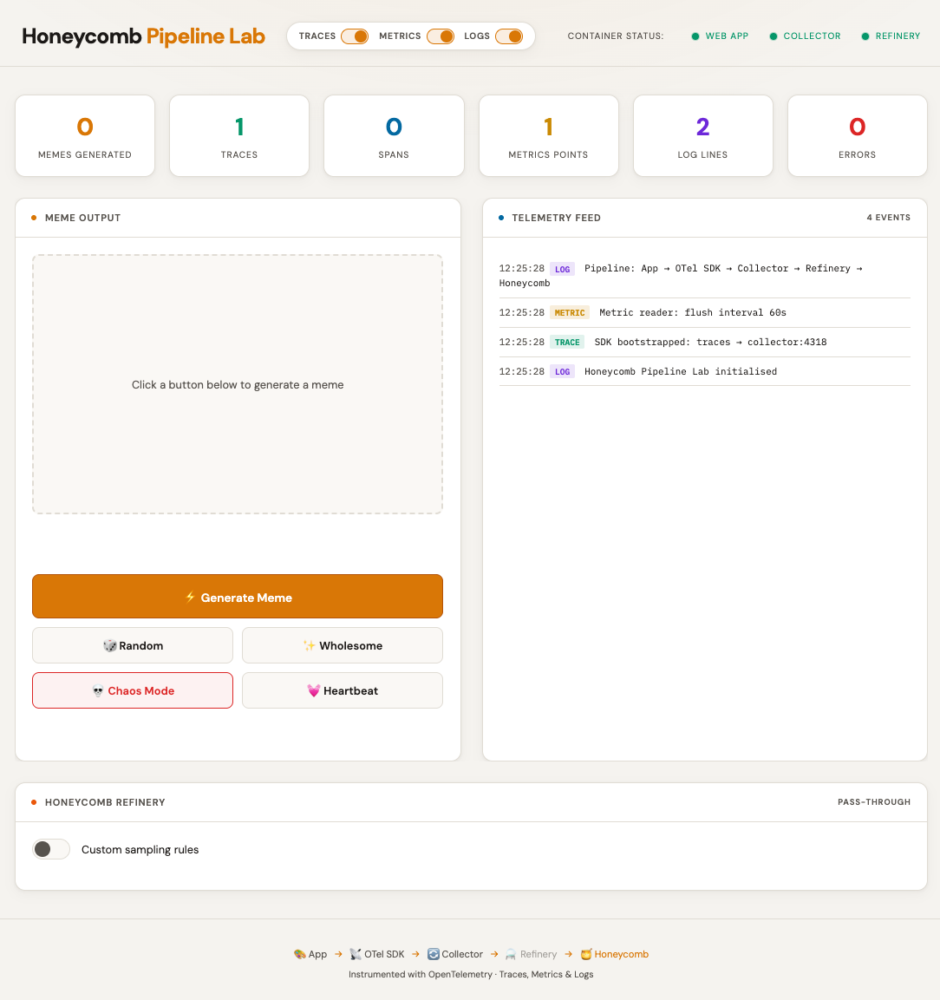
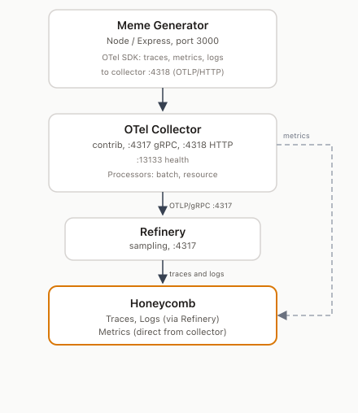

# Honeycomb Pipeline Lab 🎨🔭

A fully-instrumented web app that generates observability-themed memes while producing **real OpenTelemetry traces, metrics, and logs** — all routed through an OTel Collector and Refinery to Honeycomb.

<p align="center">
  
</p>

## Architecture

<p align="center">
  
</p>

**Refinery** is Honeycomb's sampling proxy. Traces and logs flow through Refinery before reaching Honeycomb; metrics go directly. Toggle custom sampling rules from the UI and edit rules in YAML.

## Quick Start

### 1. Copy the environment template

```bash
cp .env.example .env
```

### 2. Add your Honeycomb API key

Edit `.env` and paste your Honeycomb API key.

### 3. Start everything

```bash
docker compose up --build
```

### 4. Open the app

Navigate to **<http://localhost:3000>** and start clicking buttons!

### 5. Check Honeycomb

Go to [ui.honeycomb.io](https://ui.honeycomb.io) and look for the `meme-generator` service.

## What Gets Instrumented

### Traces

Every button click produces a multi-span trace:

| Span | Description |
|------|-------------|
| `generate-meme` | Parent span — full meme generation pipeline |
| `select-template` | Picks a meme template (10–50ms) |
| `generate-captions` | Creates top/bottom text (30–120ms) |
| `render-meme` | "Renders" the meme (50–200ms, occasionally slow) |
| `quality-check` | Validates output (10–40ms, 5% warn rate) |
| `rate-meme` | Records user rating |
| `chaos-endpoint` | Deliberately unstable endpoint |

Plus automatic HTTP + Express spans from auto-instrumentation.

### Metrics

| Metric | Type | Description |
|--------|------|-------------|
| `memes.generated` | Counter | Total memes, by template and mode |
| `memes.generation.duration` | Histogram | Generation latency in ms |
| `ui.button.clicks` | Counter | Clicks by button type |
| `users.active` | UpDownCounter | Simulated active user gauge |
| `errors.total` | Counter | Errors by type |

### Logs

Structured OTel log records at DEBUG, INFO, WARN, and ERROR levels with attributes like `meme.id`, `meme.template`, `chaos.type`, and `quality.issue`.

## Buttons

- **⚡ Generate Meme** — The main event. Produces a full trace with 4 child spans.
- **🎲 Random** — Same as generate, tagged with `mode=random`.
- **✨ Wholesome** — Tagged with `mode=wholesome`.
- **💀 Chaos Mode** — ~33% chance of timeout, ~33% chance of 500 error, ~33% survival. Great for testing error handling in Honeycomb.
- **💓 Heartbeat** — Fires a liveness ping. Increments the `users.active` gauge.
- **Rating buttons** — Rate the generated meme; each fires a trace + metric.

## Refinery (Sampling)

A **Honeycomb Refinery** card appears in the UI. Use it to:

- **Toggle** custom sampling rules on/off. When off, Refinery keeps 100% of traces (pass-through). When on, the default rules sample **1 in 10** traces (`SampleRate: 10`).
- **Edit rules** in YAML when enabled. Change `SampleRate` to adjust volume (e.g. `10` → one tenth of traces).

Refinery reloads rules automatically (about every 15 seconds). See [Refinery sampling methods](https://docs.honeycomb.io/manage-data-volume/sample/honeycomb-refinery/sampling-methods/) for rule syntax.

## Customisation

### Point to a different collector

Set `OTEL_EXPORTER_OTLP_ENDPOINT` in `docker-compose.yml` to any OTLP-compatible endpoint.

### Change the service name

Set `OTEL_SERVICE_NAME` in `docker-compose.yml`.

### Adjust metric flush interval

Edit `exportIntervalMillis` in `app/tracing.js` (default: 60s).

### Telemetry export toggles

Use the **Traces**, **Metrics**, and **Logs** switches in the header to stop that signal from being exported to the collector (and Honeycomb). Defaults are all on. State is in-memory on the app process only.

## Cleanup

```bash
docker compose down
```
